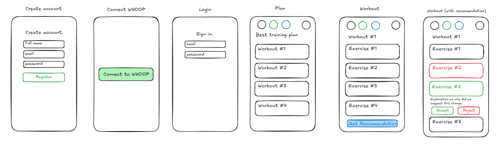
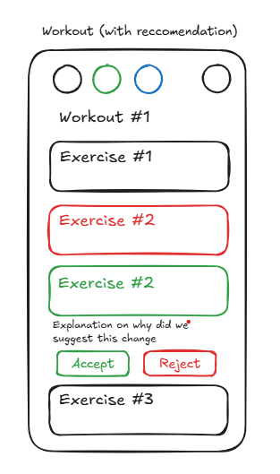

# AI Coach app.

## Description 

This app is an AI Coach that gives recommendations for workouts. In the app, the user is able to view their workout plan, the workouts in the workout plan, and the exercises. Then there's a Get Recommendation button that is able to get a workout recommendation for one specific workout. The users are linked to their WHOOP data through the WHOOP APIs. For MVP, the design of the app is going to contain 5 pages: Register, Log in, Connect WHOOP, Plan ,and Work Out

Below is the overview of each page.

### Page Sketches



## 1. Register page

The page will be very minimal with a create account label, fullname, email and password fields, and a register button.
There is no need to fetch any data for this page. On click of the register button, the app should call the `POST /users/register` endpoint with the following payload: 
```JSON
{
  "email": "{{email}}",
  "password": "{{password}}",
  "display_name": "{{displayName}}"
}
```
After access to registration, the app should call the `POST /users/login` endpoint with the new email and password as payload.
```JSON
{
  "email": "{{email}}",
  "password": "{{password}}"
}
```
As the response, we should get an access token. The refresh token should be set as a cookie by the server.

The register page should also have a button with a link to the sign-in page if the user is already registered. 

## 2. Connect WHOOP page

This page will be very minimal, with only a "Connect to WHOOP" button. This page is going to immediately follow the registration of a new user. When the user clicks on the "Connect to WHOOP" button, the app should call the `GET /whoop/connect-url/` endpoint with the access token obtained by calling the login endpoint. This endpoint will return the connect URL which should the react app redirect to.

On successful response, the user should line on the plan page. 

## 3. Login page

The login page will contain:
- a "Sign in" title
- sign-in fields for our email and password
- a sign-in button
On the click of the sign-in button, it's going to execute the `POST /users/login` endpoint.

The login page also contains a button to redirect to the register page. 

## 4. Plan page
 
Plan Page is the first page that is often dedicated. There should be a common layout for the Plan and Workout pages. On top of the screen, there should be the section with the current WHOOP metrics and a user profile. The WHOOP metrics should follow the design guide in https://developer.whoop.com/assets/files/WHOOP%20-%20Brand%20&%20Design%20Guidelines-bdea3554e94b4ea09e68695b1e8dc8e7.pdf the metrics should display sleep score, recovery, and strain in a circular this way will be filled based on the values. There should also be a "Powered by WHOOP" label under these metrics. On the right side, there should be a user profile button, a circle with the initials of the user.

Below the header, there should be a plan name title followed by the workout items, which will be small rectangles in a stack on top of each other. The workouts should be scrollable. The workouts should only display:
- name
- date
- number of exercises 
- expected time

The workout items will also be a button that will redirect to the workout page of the appropriate workout.

This page should get the plan from the `GET plans/:id` endpoint and the workouts from the `GET plans/:id/workouts` endpoint. 

## 5. Workout page

The workout page will have the same header as in the plan page and same layout. The workout page will have a workout title under the header with a list of exercises below. At the bottom of the screen there will be a Get Recommendation button. Similarly to the plan page, the exercises should be scrollable. The exercises should display:
- Name
- Sets and Reps or Time and Effort

This page should get the workout info from the `GET workouts/:id` and exercises from the `GET workout/:id` endpoint. 

When a user clicks the Get Recommendation button it should invoke a request to `POST recommendations/generate` with the following payload:
```JSON
{
    "workoutId": "{{workoutId}}"
}
```

After the user clicks the Get recommendation button, the page should display a spinner before a response is returned. The response is going to return a recommendation ID, and the page needs to fetch the recommendation based on the ID. The endpoint to get the recommendation is `GET recommendations/:id`. The page should display the recommendations on the individual exercises (recommendation operation) using red and green displays. If the recommendation just modifies the exercise, only show the green and red changes. If the recommendation is to replace the exercise, show the exercise that's being replaced in red and the exercise that's replacing in green. Similar logic for adding an exercise or removing an exercise. Under each recommendation, there should be an explanation and an accept or reject button. The Accept and Reject buttons should call the `PATCH recommendations/:id` With the status in the payload as Rejected or Approved. When recommendations are displayed to the user, the Get Recommendation button should be hidden. Below is a sketch of the screen with recommendations.



# Global state

The user and WHOOP summary should be in a global state.

# Design guide

Follow:
- Best Front-End Architecture Practices
- Feature-based Development
- Feature modules split into components, hooks, and services