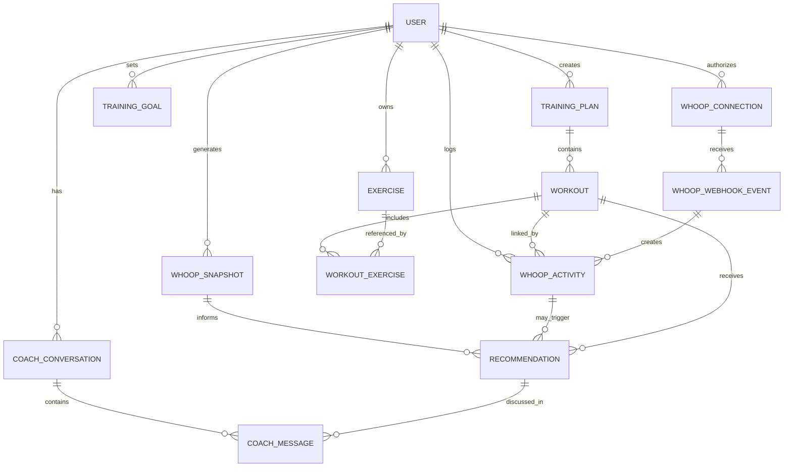

# Domain Design

## Purpose

This document captures the first draft of the WHOOP AI Coach domain model. It is meant to describe the core business concepts before implementation details harden too early.

The application helps a user adapt training decisions based on WHOOP recovery, sleep, strain, recent activity, personal goals, and preferred exercises.

## Domain Summary

WHOOP AI Coach sits between three important sources of context:

- The user's physiological readiness from WHOOP.
- The user's intended training plan.
- The user's personal exercise preferences, goals, and constraints.

The application should not simply generate random workouts. It should recommend changes to an existing plan, explain why, and let the user accept or reject those changes.

## Decisions So Far

- Primary experiences: daily workout recommendation and AI chat coach.
- Workouts: create from scratch or adapt existing workouts.
- Goals: AI helps the user define and pursue a goal such as general fitness or strength.
- Exercise bank: seed with defaults, then let the user customize.
- Exercise preferences: global for the first version.
- Subjective readiness: not a first-class data input yet.
- WHOOP data storage: persist normalized snapshots.
- Retention: keep WHOOP snapshots for one month to start.
- Recommendation lifecycle: recommendations can expire or be superseded by newer WHOOP data.
- WHOOP integration: use webhooks so new activity can trigger a new recommendation.
- Workout linkage: link WHOOP activities to planned workouts where possible.
- Workout completion: manual logging remains the default.
- Approval: workout changes require explicit user approval.
- Fallback behavior: if WHOOP data is missing, rely on plan and coach context.
- Safety: keep unsafe recommendations out of the MVP.
- Confidence score: not tracked yet.
- Audit trail: track AI-generated changes and recommendation statuses.

## Domain Diagram



## Core Domain Concepts

### User

Represents the athlete using the application.

Key responsibilities:

- Owns WHOOP authorization.
- Owns training goals and preferences.
- Owns exercise bank and training plans.
- Owns coach conversations and recommendation history.

Potential fields:

- `id`
- `email`
- `display_name`
- `whoop_user_id`
- `created_at`
- `updated_at`

### WHOOP Connection

Represents the user's authorization to access WHOOP data.

Key responsibilities:

- Stores OAuth connection metadata.
- Tracks token validity and refresh behavior.
- Records scopes granted by the user.
- Supports revocation.

Potential fields:

- `user_id`
- `access_token`
- `refresh_token`
- `expires_at`
- `scopes`
- `connected_at`
- `revoked_at`

Security note: tokens should be encrypted at rest.

### WHOOP Snapshot

Represents normalized WHOOP metrics for a point in time or day.

This should be separate from raw API responses so the recommendation engine can work with stable application-owned data.

Potential fields:

- `user_id`
- `date`
- `recovery_score`
- `sleep_performance_percent`
- `day_strain`
- `hrv_rmssd_milli`
- `resting_heart_rate`
- `sleep_duration_minutes`
- `recent_workout_count`
- `raw_payload_reference`

### WHOOP Activity

Represents a WHOOP activity or workout event imported from the API or webhook stream.

Potential fields:

- `id`
- `user_id`
- `whoop_activity_id`
- `activity_type`
- `started_at`
- `ended_at`
- `strain`
- `source`
- `linked_workout_id`
- `raw_payload_reference`

### WHOOP Webhook Event

Represents an incoming WHOOP webhook notification that can trigger data refresh and a new recommendation.

Potential fields:

- `id`
- `user_id`
- `event_type`
- `event_time`
- `payload`
- `processed_at`
- `status`

### Training Goal

Represents what the user is currently training toward.

Examples:

- General fitness
- Strength
- Hypertrophy
- Endurance
- Fat loss
- Recovery
- Sport-specific performance

Potential fields:

- `user_id`
- `goal_type`
- `priority`
- `target_date`
- `notes`
- `active`

### Exercise

Represents an exercise the user can include in workouts.

Key responsibilities:

- Captures what the movement is.
- Captures equipment requirements.
- Captures training purpose.
- Supports recommendation filtering.

Potential fields:

- `id`
- `user_id`
- `name`
- `category`
- `primary_muscle_group`
- `secondary_muscle_groups`
- `equipment`
- `default_intensity`
- `is_favorite`
- `is_avoided`
- `notes`

### Exercise Bank

The user's personal library of preferred, available, and avoided exercises.

This is important because the app should recommend workouts the user would actually do. A recovery-aware plan is less useful if it recommends unavailable equipment or disliked movements.

Rules:

- Recommendations should prefer favorite exercises when appropriate.
- Avoided exercises should not appear unless explicitly requested.
- Equipment constraints should be respected.
- Exercise substitutions should preserve training intent where possible.

### Training Plan

Represents a structured set of planned workouts.

Key responsibilities:

- Provides the baseline plan before AI adaptation.
- Groups workouts over time.
- Tracks plan-level goal and status.

Potential fields:

- `id`
- `user_id`
- `name`
- `goal`
- `start_date`
- `end_date`
- `status`

### Workout

Represents a planned or completed training session.

Key responsibilities:

- Stores the intended workout.
- Stores the final completed workout.
- Provides the main object that recommendations modify.

Potential fields:

- `id`
- `training_plan_id`
- `scheduled_date`
- `name`
- `workout_type`
- `status`
- `planned_intensity`
- `planned_duration_minutes`
- `completed_at`
- `actual_strain`
- `notes`

Workout statuses:

- `planned`
- `recommended_change_pending`
- `accepted`
- `completed`
- `skipped`
- `modified`

### Workout Exercise

Represents one exercise inside a workout.

Potential fields:

- `workout_id`
- `exercise_id`
- `order`
- `sets`
- `reps`
- `duration_seconds`
- `distance`
- `load`
- `intensity`
- `rest_seconds`
- `notes`

### Recommendation

Represents a proposed change or coaching suggestion.

Key responsibilities:

- Records what was recommended.
- Records why it was recommended.
- Records whether the user accepted, rejected, or modified it.

Potential fields:

- `id`
- `user_id`
- `workout_id`
- `whoop_snapshot_id`
- `recommendation_type`
- `summary`
- `rationale`
- `proposed_changes`
- `status`
- `created_at`

Recommendation statuses:

- `proposed`
- `accepted`
- `declined`
- `modified`
- `expired`
- `superseded`

### Coach Conversation

Represents user interaction with the AI coach.

Key responsibilities:

- Stores conversational context.
- Links recommendations back to chat interactions.
- Preserves auditability for AI-driven changes.

Potential fields:

- `id`
- `user_id`
- `started_at`
- `last_message_at`
- `topic`

### Coach Message

Represents one message in a coach conversation.

Potential fields:

- `conversation_id`
- `role`
- `content`
- `tool_calls`
- `created_at`

## Suggested Bounded Contexts

### Identity and Authorization

Owns:

- User identity
- WHOOP OAuth connection
- Token storage and refresh
- Access revocation

### WHOOP Data

Owns:

- WHOOP API client
- Raw API response handling
- Metric normalization
- WHOOP snapshots

### Training Planning

Owns:

- Training plans
- Workouts
- Exercises
- Exercise bank
- Completed workout history

### Recommendation Engine

Owns:

- Readiness evaluation
- Workout adjustment rules
- Recommendation creation
- Recommendation status lifecycle

### AI Coach

Owns:

- Prompt construction
- Tool definitions
- Structured model outputs
- Conversation history
- AI response validation

The AI Coach should not directly own persistence for workouts or WHOOP data. It should request approved actions through application services.

## Important Domain Rules

- The user must authorize WHOOP access before WHOOP data can be imported.
- AI-generated recommendations must be validated before they update a workout.
- A recommendation should be linked to the WHOOP snapshot that informed it.
- A planned workout should remain distinguishable from the completed workout.
- The application should preserve enough history to explain why a recommendation was made.
- User preferences and avoided exercises should override generic workout recommendations.
- Low recovery should not automatically mean rest; the recommendation should consider goals, recent load, and workout type.
- Missing WHOOP data should degrade gracefully into preference-based planning.

## Draft Recommendation Inputs

The first version of the recommendation engine should consider:

- Latest recovery score
- Latest sleep performance
- Current or recent day strain
- Recent workout history
- Today's planned workout
- User training goal
- Available equipment
- Favorite and avoided exercises
- Available training time

## MVP Recommendation Engine

### Can Change

- Create a new workout from the user's goal and exercise bank.
- Adapt an existing workout for today's readiness.
- Swap exercises while preserving training intent.
- Adjust volume, intensity, and duration.
- Mark a workout as needing approval.
- Expire or supersede a recommendation when new WHOOP data arrives.

### Cannot Change

- Apply changes without explicit user approval.
- Modify historical completed workouts.
- Ignore safety boundaries entirely.
- Rely on raw WHOOP data without normalized snapshots.
- Assume subjective readiness as a required input.

## Draft Database Schema

### users

- `id`
- `email`
- `display_name`
- `whoop_user_id`
- `created_at`
- `updated_at`

### whoop_connections

- `id`
- `user_id`
- `access_token`
- `refresh_token`
- `expires_at`
- `scopes`
- `connected_at`
- `revoked_at`

### whoop_snapshots

- `id`
- `user_id`
- `snapshot_date`
- `recovery_score`
- `sleep_performance_percent`
- `day_strain`
- `hrv_rmssd_milli`
- `resting_heart_rate`
- `sleep_duration_minutes`
- `raw_payload_reference`
- `created_at`

### whoop_activities

- `id`
- `user_id`
- `whoop_activity_id`
- `activity_type`
- `started_at`
- `ended_at`
- `strain`
- `linked_workout_id`
- `raw_payload_reference`
- `created_at`

### training_goals

- `id`
- `user_id`
- `goal_type`
- `priority`
- `target_date`
- `notes`
- `active`

### exercises

- `id`
- `user_id`
- `name`
- `category`
- `primary_muscle_group`
- `equipment`
- `default_intensity`
- `is_favorite`
- `is_avoided`
- `notes`

### training_plans

- `id`
- `user_id`
- `name`
- `goal`
- `start_date`
- `end_date`
- `status`

### workouts

- `id`
- `training_plan_id`
- `scheduled_date`
- `name`
- `workout_type`
- `status`
- `planned_intensity`
- `planned_duration_minutes`
- `completed_at`
- `actual_strain`
- `notes`

### workout_exercises

- `id`
- `workout_id`
- `exercise_id`
- `position`
- `sets`
- `reps`
- `duration_seconds`
- `load`
- `rest_seconds`
- `notes`

### recommendations

- `id`
- `user_id`
- `workout_id`
- `whoop_snapshot_id`
- `whoop_activity_id`
- `recommendation_type`
- `summary`
- `rationale`
- `proposed_changes`
- `status`
- `expires_at`
- `created_at`

### coach_conversations

- `id`
- `user_id`
- `started_at`
- `last_message_at`
- `topic`

### coach_messages

- `id`
- `conversation_id`
- `role`
- `content`
- `tool_calls`
- `created_at`

## Draft Recommendation Outputs

The recommendation engine should return:

- Recommendation summary
- Coaching rationale
- Suggested workout changes
- Confidence or strength of recommendation
- Risks or caveats
- Whether user approval is required

Example:

```json
{
  "summary": "Reduce lower-body intensity today",
  "rationale": "Recovery is below baseline and recent strain is high.",
  "changes": {
    "intensity": "moderate",
    "remove_exercises": ["heavy back squat"],
    "add_exercises": ["goblet squat", "mobility circuit"]
  },
  "requires_user_approval": true
}
```

## Concrete User Workflows

### 1. Daily Recommendation

1. WHOOP webhook arrives or the app refreshes snapshot data.
2. The recommendation engine reads the latest normalized snapshot and today’s workout.
3. The app generates a recommendation from the user’s goal and exercise bank.
4. The user accepts, declines, or edits the workout.

### 2. Build a Goal

1. The user asks the coach to help define a goal.
2. The coach asks for the simplest useful details.
3. The app creates a training goal and seeds a starter plan.
4. Future recommendations adapt around that goal.

### 3. New Activity Linked to a Workout

1. WHOOP posts a new activity event.
2. The app imports the activity and tries to match it to a planned workout.
3. The linked workout is marked completed or modified.
4. A follow-up recommendation is created if needed.

## Open Questions

- How should the app represent subjective readiness, soreness, injury, mood, and motivation?
- What data should be included in prompts, and what should be excluded for privacy and token efficiency?
- What does success look like for the first demo?

## Next Design Pass

The next pass should turn this draft into:

- A more detailed safety and approval policy.
- Prompt input/output boundaries for the AI coach.
- A first pass at webhook processing and recommendation expiry rules.
